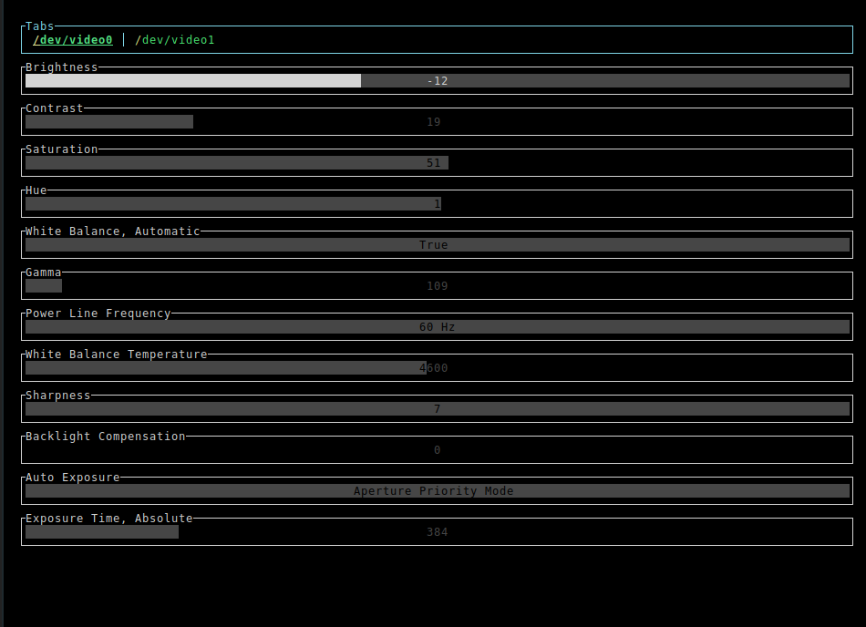

# v4l2-tctl: Terminal Control for V4L2 Devices

v4l2-tctl is a command-line utility designed to provide users with a convenient interface to control and manage V4L2 devices.(akin to how pulsemixer operates for audio)
  With a simple terminal-based interface, users can easily adjust settings.
  Whether you're working on a headless setup, ssh'ing into a remote machine, or simply prefer the terminal, v4l2-tctl makes your life easier.

